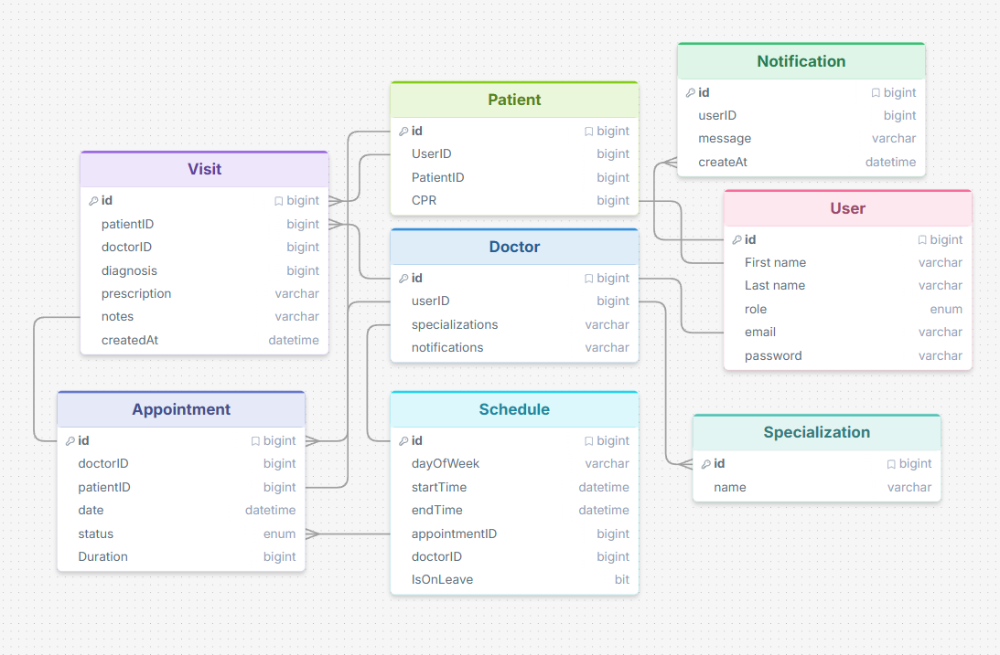

# Advanced-Programming

## DATE: 3/20/2026

### By:
[Mohamed Alnooh](https://github.com/alnoohy) | 
[Manaf Hujairi](https://github.com/Manaf-10) | 
[Abdulla Alwaraqaa](https://github.com/AbdullahAlwarqaa) | 
[Mohamed Jaffar](https://github.com/MohamedJaafar0) | [Mahmood Abdulla](https://github.com/Mahm64d)

## ERD

## Routing Table

Notion routing table: [Routing Table](https://www.notion.so/Routing-Table-32c1a2392a5e8075935ac7b550635ad6?source=copy_link)

### Authentication

| Method | Route | Access | Description | Status |
| --- | --- | --- | --- | --- |
| GET | `/auth/login` | Public | Display the login form | Not started |
| POST | `/auth/login` | Public | Authenticate user and create session/JWT | Not started |
| GET | `/auth/register` | Public | Display the patient registration form | Not started |
| POST | `/auth/register` | Public | Create a new patient account | Not started |
| GET | `/account/profile` | Authenticated | Display the current user's profile | Not started |

### Appointment

| Method | Route | Access | Description | Status |
| --- | --- | --- | --- | --- |
| GET | `/appointments/book` | Staff | Display appointment booking form | Not started |
| POST | `/appointments/book` | Staff | Create a new appointment | Not started |
| GET | `/appointments/:id` | Staff | Display appointment details | Not started |
| PATCH | `/appointments/:id/status` | Staff | Update appointment status and broadcast live update via SignalR | Not started |
| GET | `/appointments/live` | Staff | Display live appointment queue/status board | Not started |
| POST | `/public/appointments/lookup` | Public | Lookup appointments by CPR and patient reference | Not started |
| HUB | `/hubs/appointments` | Staff | SignalR hub used for live appointment status updates | Not started |

### Visit History

| Method | Route | Access | Description | Status |
| --- | --- | --- | --- | --- |
| GET | `/patients/:id/history` | Staff | Display a patient's full visit history | Not started |
| GET | `/visit-records/:id` | Staff | Display visit diagnosis, doctor notes, and prescriptions | Implemented for Doctor |
| POST | `/visit-records` | Doctor | Create a visit record after an appointment is completed | Not started |
| POST | `/prescriptions` | Doctor | Create a prescription linked to a completed visit | Not started |
| GET | `/prescriptions/:id` | Staff and the Patient | Display prescription details for an authorized user | Not started |

### Doctor

| Method | Route | Access | Description | Status |
| --- | --- | --- | --- | --- |
| POST | `/visit-records` | Doctor | Create a new diagnosis or visit record | Not started |
| GET | `/visit-records` | Doctor | Display visit records for the logged-in doctor's patients | Implemented |
| GET | `/doctors/:id/availability` | Staff | Display available time slots for a doctor | Not started |
| GET | `/doctors/:id/appointments` | Staff | Display appointments assigned to a doctor | Not started |

### Notifications

| Method | Route | Access | Description | Status |
| --- | --- | --- | --- | --- |
| GET | `/notifications` | Authenticated | Display appointment alerts and system notifications | Not started |
| DELETE | `/notifications/:id` | Authenticated | Delete a dismissed notification from the database | Not started |

### Manager

| Method | Route | Access | Description | Status |
| --- | --- | --- | --- | --- |
| GET | `/doctors` | Staff | List all doctors | Not started |
| GET | `/doctors/:id` | Clinic Manager | Display doctor details and edit form | Not started |
| PUT | `/doctors/:id` | Clinic Manager | Update doctor profile details | Not started |
| PUT | `/appointments/:id` | Clinic Manager | Update appointment details | Not started |
| POST | `/doctors/:id/availability` | Clinic Manager | Create or update doctor availability | Not started |
| GET | `/reports/statistics` | Clinic Manager | Display overall appointment statistics | Not started |
| GET | `/reports/doctor-workload` | Clinic Manager | Display doctor workload and utilization report | Not started |
| GET | `/reports/cancellations` | Clinic Manager | Display cancellation and missed appointment report | Not started |

### Specializations

| Method | Route | Access | Description | Status |
| --- | --- | --- | --- | --- |
| GET | `/specializations` | Staff | List specializations | Not started |
| POST | `/specializations` | Clinic Manager | Create specialization | Not started |
| PUT | `/specializations/:id` | Clinic Manager | Edit specialization | Not started |
| POST | `/doctors/:id/specializations` | Clinic Manager | Assign specialization to doctor | Not started |
